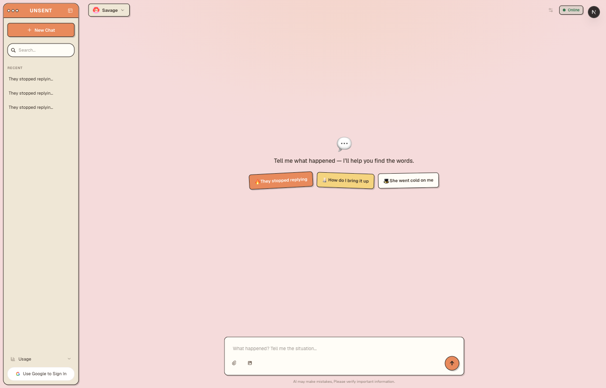

# 🤖 AI Chat

A production-style AI chat web app built with **Next.js 16**, **React 19**, six **Google Gemini** models, and **OpenAI GPT-4o mini**.  
Designed to simulate the architecture and UX patterns used in real AI products like ChatGPT and Claude.

<p align="center">
  
</p>

> 📹 A demo GIF (streaming + code highlight flow) will replace this screenshot once the remaining features are done.

---

## ✨ Features

### Core Chat

- **Real-time streaming** — Chunk-by-chunk output via SSE (Server-Sent Events), with 40ms throttle on state updates
- **Multi-model support** — Seven models across two providers: Gemini 3.6 Flash, 3.5 Flash, 3.5 Flash Lite, 3.1 Flash Lite, 3 Flash (Preview), 2.5 Flash, and GPT-4o mini. The selector shows provider icons and a checkmark on the active model. Default is **Gemini 3.1 Flash Lite** — chosen for its free-tier quota of 500 requests/day, where 2.5 Flash allows only 20
- **Multi-turn context** — Maintains conversation history with a sliding window (last 10 turns)
- **Stop generation** — Cancel mid-stream with `AbortController`
- **Regenerate** — Re-run the last AI response with one click

### Message UX

- **Edit messages** — Modify any past message and regenerate from that point (conversation branching)
- **Copy** — Copy message content or code blocks to clipboard
- **Reactions** — Like / dislike toggle with count display
- **Auto-scroll** — Always keeps the latest message in view
- **Live streaming stats** — Elapsed seconds and an estimated token count tick during generation, then swap to the real server-reported numbers for 3 seconds once the stream ends
- **Usage panel** — Cumulative input/output tokens and estimated cost, priced per model. Works for both signed-in users (aggregated in Postgres) and guests (aggregated from `localStorage`)

### Markdown & Code

- Full **GitHub-Flavored Markdown** rendering (tables, lists, bold, inline code)
- **Syntax highlighting** with language detection
- **Colored language badges** — JS, TS, PY, HTML, CSS, etc.
- One-click **copy code** button with copied state feedback

### Conversation Management

- **Multi-conversation sidebar** — ChatGPT-style sidebar with search and conversation switching
- **Conversation rename** — Inline title editing via pencil icon
- **Mobile responsive** — Sidebar becomes an overlay drawer on small screens; `☰` button in header; tap outside to close

### Persistence

- Chat history persisted to **PostgreSQL** via REST API after stream ends
- Conversations and messages linked to authenticated user
- Full history restored on page refresh via server-side fetch
- **Unauthenticated users** — chat history saved to `localStorage` automatically; no login required to start chatting

### Design & UI

- **Light & dark themes** — Follows the OS preference by default, with a manual toggle that persists to `localStorage`. A blocking inline script in `<head>` resolves the theme before first paint, so there is no flash of the wrong theme (FOUC)
- **Floating header** — No solid header bar; the model selector and status / clear controls float over the chat surface
- **Glassmorphism composer** — Frosted-glass input with a gradient border ring that lifts (`translateY`) and glows on focus
- **Branded sidebar** — Gradient avatar + product name, a dedicated "New Chat" button above search, collapses to a rail
- **Polished chat bubbles** — User bubbles with a tail corner, transparent assistant messages, gradient AI avatar

### Design System

- **Type scale** — 10 steps in `rem`, hand-tuned rather than a fixed mathematical ratio: dense at the small end (11–18px) for information-heavy product UI, widening at the display end (24–56px). The four display steps are fluid via `clamp(min, Arem + Bvw, max)`, so headings scale continuously between viewports without breakpoints
- **Spacing scale** — 14 steps on a 4pt grid with half-steps, named after their pixel value (`--space-10` is 10px)
- **Icon scale kept separate from the type scale** — several `font-size` declarations were really sizing emoji/icons; mixing them into the type scale means resizing an avatar would perturb body-copy proportions
- **Fully tokenized** — 59 theme-dependent tokens defined for both themes plus 34 theme-independent ones; every color, radius, shadow, font size and spacing value in `globals.css` resolves through a CSS variable

### Accessibility

- **Visible keyboard focus** — `:focus-visible` rings that appear on keyboard navigation but not on mouse click
- **Reduced-motion support** — `prefers-reduced-motion` collapses every animation and transition (using `0.01ms` rather than `none`, so `transitionend` / `animationend` still fire)
- **Contrast verified** — small text measured against its *effective composited* background, not just its token value; muted ink and status colors were darkened from the source design to clear WCAG AA (4.5:1)
- **Zoom-safe fluid type** — the fluid steps mix `rem` into the `vw` term so browser font-size settings still take effect (WCAG 1.4.4)
- **Theme-aware browser chrome** — `<meta name="theme-color">` tracks the active theme

---

## 🛠 Tech Stack

| Layer               | Tech                                        |
| ------------------- | ------------------------------------------- |
| Framework           | Next.js 16 (App Router)                     |
| Language            | TypeScript                                  |
| AI Models           | Google Gemini (6 models), OpenAI GPT-4o mini |
| Streaming           | Server-Sent Events (SSE)                    |
| Auth                | NextAuth.js v4 (Google OAuth)               |
| Database            | PostgreSQL + Prisma ORM                     |
| Markdown            | react-markdown + remark-gfm                 |
| Syntax Highlighting | react-syntax-highlighter (oneDark / oneLight, theme-aware) |
| Icons               | Font Awesome, Lucide React, icons8 CDN      |
| Styling             | Pure CSS with CSS Variables + Tailwind 4    |
| Theming             | `data-theme` attribute + `useSyncExternalStore` |
| Testing             | Jest + React Testing Library                |
| Component Workshop  | Storybook 10 (isolated dev + auto-docs)     |
| Containerization    | Docker (multi-stage) + Docker Compose       |
| CI/CD               | GitHub Actions (multi-arch build & push)    |

---

## 🚀 Getting Started

### Prerequisites

- Node.js 20.9+ (Next.js 16 requirement; the Docker images use Node 22)
- PostgreSQL database
- [Google AI Studio](https://aistudio.google.com) API key (for Gemini)
- OpenAI API key (for GPT-4o mini)
- Google OAuth credentials (for authentication)

### Installation

```bash
git clone https://github.com/spencertyy/AI-ChatBot.git
cd AI-ChatBot/typescript
npm install
```

### Environment Variables

Create a `.env.local` file in the `typescript/` directory:

```
GEMINI_API_KEY=your_gemini_key
OPENAI_API_KEY=your_openai_key
GOOGLE_CLIENT_ID=your_google_client_id
GOOGLE_CLIENT_SECRET=your_google_client_secret
NEXTAUTH_SECRET=your_nextauth_secret
NEXTAUTH_URL=http://localhost:3000
DATABASE_URL=postgresql://your_connection_string
```

### Run

```bash
npm run dev
```

Open [http://localhost:3000](http://localhost:3000)

---

## 🐳 Run with Docker

The entire stack — app **and** PostgreSQL — runs with a single command. No local Node or Postgres install required, only Docker.

```bash
# 1. Create your env file from the template, then fill in your keys
cp .env.docker.example .env.docker

# 2. Build images, start the DB, run migrations, launch the app
docker compose up -d --build
```

Open [http://localhost:3000](http://localhost:3000).

What `docker compose up` orchestrates:

| Service   | Image                 | Role                                                       |
| --------- | --------------------- | --------------------------------------------------------- |
| `db`      | `postgres:16-alpine`  | PostgreSQL; data persisted in the `pgdata` volume         |
| `migrate` | builder stage         | Runs `prisma migrate deploy` once, then exits             |
| `web`     | runner stage (~317MB) | Next.js app (standalone output), served on port 3000      |

Startup is gated by health checks — **db healthy → migrations applied → app starts** (`service_completed_successfully`) — so the app never boots against an unmigrated database.

Common commands:

```bash
docker compose logs -f web   # tail app logs
docker compose down          # stop (keeps DB data)
docker compose down -v       # stop + wipe the database volume
```

### Pull the prebuilt image

The runtime image is published to Docker Hub:

```bash
docker pull spencertu/ai-chat:1.0
```

> Built with a multi-stage Dockerfile (deps → `prisma generate` + `next build` → minimal **non-root** runtime via Next.js `output: "standalone"`), cutting the image from ~1 GB to ~317 MB. Secrets are injected at runtime via `env_file` — never baked into the image.

### Continuous deployment (CI/CD)

A **GitHub Actions** workflow ([`.github/workflows/docker-publish.yml`](.github/workflows/docker-publish.yml)) keeps the published image up to date automatically: on every push to `main`, it builds a **multi-arch (amd64 + arm64)** image with `docker buildx` and pushes it to Docker Hub, using GitHub Actions layer caching for fast runs. Docker Hub credentials are stored as encrypted repository secrets — never committed.

---

## 📁 Project Structure

```
.storybook/                              # Storybook config (main.ts, preview.tsx)
src/
├── app/
│   ├── api/
│   │   ├── auth/[...nextauth]/route.ts   # NextAuth handler
│   │   ├── chat-stream/route.ts          # SSE streaming endpoint (Gemini + OpenAI)
│   │   ├── usage/route.ts                # GET aggregated token usage & cost
│   │   └── conversations/
│   │       ├── route.ts                  # GET list, POST create
│   │       └── [id]/
│   │           ├── route.ts              # DELETE, PATCH title
│   │           └── messages/
│   │               ├── route.ts          # POST save messages
│   │               └── route.test.ts     #   └ test (authorization, transaction)
│   ├── components/
│   │   ├── AuthButton.tsx                # Google login/logout UI
│   │   ├── AuthButton.stories.tsx        #   └ story (mocked SessionProvider)
│   │   ├── CodeBlock.tsx                 # Syntax highlighted code blocks
│   │   ├── CodeBlock.stories.tsx         #   └ story (langs, fallback, overflow)
│   │   ├── InputArea.tsx                 # Chat input (attach / image / send)
│   │   ├── InputArea.stories.tsx         #   └ story (idle / loading, fn() mocks)
│   │   ├── InputArea.test.tsx            #   └ test (typing, Enter-to-send)
│   │   ├── MarkDownRenderer.tsx          # Markdown rendering
│   │   ├── MarkDownRenderer.stories.tsx  #   └ story (GFM doc, table, code block)
│   │   ├── MessageList.tsx               # Message list + action buttons
│   │   ├── ModelSelector.tsx             # Model selector dropdown (used in header)
│   │   ├── ModelSelector.test.tsx        #   └ test (render, open, select callback)
│   │   ├── Providers.tsx                 # NextAuth SessionProvider wrapper
│   │   ├── Sidebar.tsx                   # Conversation list sidebar
│   │   ├── StreamingStats.tsx            # Live elapsed time + token count during streaming
│   │   ├── ThemeToggle.tsx               # Light/dark toggle (sun ↔ moon pill)
│   │   └── UsagePanel.tsx                # Cumulative token usage & cost panel
│   ├── hooks/
│   │   ├── useChat.ts                    # All chat logic (custom hook)
│   │   ├── useChat.test.ts               #   └ test (44 cases: streaming, cancel, branching)
│   │   └── useTheme.ts                   # Theme state via useSyncExternalStore
│   ├── lib/
│   │   ├── localStorageChat.ts           # localStorage read/write for unauthenticated users
│   │   ├── localStorageChat.test.ts      #   └ test (save / load / delete)
│   │   ├── pricing.ts                    # Per-model token cost calculation
│   │   ├── pricing.test.ts               #   └ test (cost calc, unknown-model fallback)
│   │   ├── themeColors.ts                # <meta name="theme-color"> values (single source)
│   │   ├── usage.ts                      # Usage aggregation + token/cost formatting
│   │   └── usage.test.ts                 #   └ test (aggregation, null rows, formatting)
│   ├── types/
│   │   └── chat.ts                       # Message, Conversation types
│   ├── globals.css                       # All styles (consumes tokens, no hardcoded values)
│   ├── tokens.css                        # Design tokens: colors (light + dark), type scale,
│   │                                     #   icon scale, spacing scale, radii, shadows
│   ├── layout.tsx                        # Root layout + blocking theme script (anti-FOUC)
│   └── page.tsx                          # Root page
└── lib/
    ├── auth.ts                           # NextAuth config (Google + PrismaAdapter)
    └── prisma.ts                         # Prisma client singleton
```

> Test files (`*.test.ts(x)`) and Storybook stories (`*.stories.tsx`) are co-located next to the code they cover. Jest config lives in `jest.config.mjs` + `jest.setup.ts`; Storybook config lives in `.storybook/` — all at the project root.

---

## 🏗 Architecture

### Streaming Flow

```
User input → POST /api/chat-stream
           → Gemini or OpenAI streaming SDK
           → SSE chunks → TextDecoder → buffer parsing
           → 40ms throttled state updates → UI render
           → [DONE] + usage metadata → finalize message
           → POST /api/conversations/[id]/messages
```

### Conversation Branching

Editing a past message removes all subsequent responses and rebuilds  
the conversation context from the edited point — the same pattern used in ChatGPT.

---

## 🧪 Testing

**85 tests across 7 suites**, using **Jest** + **React Testing Library**, wired up through `next/jest`.

| Suite                      | Layer         | Tests | Covers                                                                                 |
| -------------------------- | ------------- | ----: | -------------------------------------------------------------------------------------- |
| `useChat.test.ts`          | Hook          |    44 | SSE parsing across split chunks, mid-stream cancellation, conversation branching, auto-titling, persistence for both guest and signed-in paths |
| `usage.test.ts`            | Pure function |    16 | Usage aggregation, null-heavy legacy rows, token/cost formatting                        |
| `pricing.test.ts`          | Pure function |    10 | Cost calculation, unknown-model fallback                                                |
| `messages/route.test.ts`   | API route     |     5 | Ownership authorization, 404-not-403 on foreign ids, transactional write                |
| `InputArea.test.tsx`       | Component     |     4 | Typing, Enter-to-send, send button (module mock)                                        |
| `localStorageChat.test.ts` | Data layer    |     3 | Save / load / delete + test isolation                                                   |
| `ModelSelector.test.tsx`   | Component     |     3 | Render, menu open, model-select callback                                                |

```bash
npm test            # run once
npm run test:watch  # watch mode
```

Philosophy: test logic that can break (pure functions, data layer, interactive components, hooks, and authorization boundaries) — not pure presentation, config, or types.

Two details worth calling out:

- **The SSE tests do not mock the parser.** They feed real `Uint8Array` chunks through a fake `Response`, with one case deliberately splitting a single SSE event mid-JSON to prove the buffer reassembles it.
- **Route handlers run in a `node` test environment**, overridden per-file via a `@jest-environment` docblock, since `NextResponse` needs the Web `Request`/`Response` globals that jsdom does not provide.

---

## 📚 Component Workshop (Storybook)

UI components are developed and documented in isolation with **Storybook 10** (Vite builder via `@storybook/nextjs-vite`), so each component can be built and reviewed without booting the full app, logging in, or hitting the database.

```bash
npm run storybook        # dev server on http://localhost:6006
npm run build-storybook  # static build
```

Stories live next to their components (`*.stories.tsx`) and cover meaningful states & edge cases:

| Component          | Stories                                                                 |
| ------------------ | ----------------------------------------------------------------------- |
| `CodeBlock`        | Per-language badges, unknown-language fallback, long-code overflow       |
| `MarkdownRenderer` | Rich GFM document, tables, fenced code blocks routed into `CodeBlock`    |
| `InputArea`        | Idle / typing / loading states; callbacks mocked via `fn()` → Actions    |
| `AuthButton`       | Signed-in vs signed-out, with a **mocked `SessionProvider`** decorator   |

> The global Tailwind v4 pipeline and design tokens are loaded once in `.storybook/preview.tsx`, so components render in Storybook exactly as they do in the app. Auth-dependent components are isolated from NextAuth by injecting a mocked session through a decorator.

---

## 📌 Planned

### Auth & Data

- [✔️] User authentication — login / signup with session management
- [✔️] Database integration — persist conversations server-side (e.g. PostgreSQL + Prisma)

### AI Features

- [ ] RAG (Retrieval-Augmented Generation) — attach documents and query over them
- [✔️] Token usage tracking — live streaming stats plus a cumulative usage & cost panel

### UX & Platform

- [ ] Add demo GIF to README (record streaming + code highlight flow)
- [✔️] Sidebar with multiple conversations
- [✔️] Conversation rename — inline editing via pencil icon
- [ ] Image upload (Gemini multimodal)
- [ ] File upload support
- [✔️] Multi-model support (OpenAI / Gemini switchable)
- [✔️] Mobile optimization — responsive sidebar drawer, touch-friendly buttons, adaptive spacing
- [✔️] UI redesign — floating header, glass composer, branded sidebar, purple ambient theme
- [✔️] Unit tests — Jest + React Testing Library
- [✔️] Storybook — isolated component dev & docs, with mocked auth session
- [✔️] Dockerized — multi-stage build + `docker compose` (app + Postgres), image published to Docker Hub
- [✔️] CI/CD — GitHub Actions auto-builds & pushes a multi-arch image on every push to `main`
- [✔️] Theme toggle (light / dark) — system-following with manual override, no FOUC
- [✔️] Design system — type scale, spacing scale, full tokenization of colors and sizing
- [✔️] Accessibility pass — `:focus-visible`, `prefers-reduced-motion`, WCAG AA contrast
- [ ] Live demo URL with abuse guardrails (rate limiting + bot protection)

---

## 📄 License

MIT
